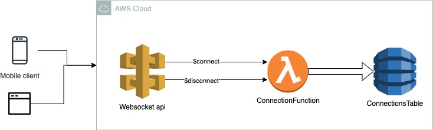
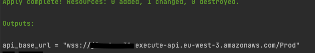
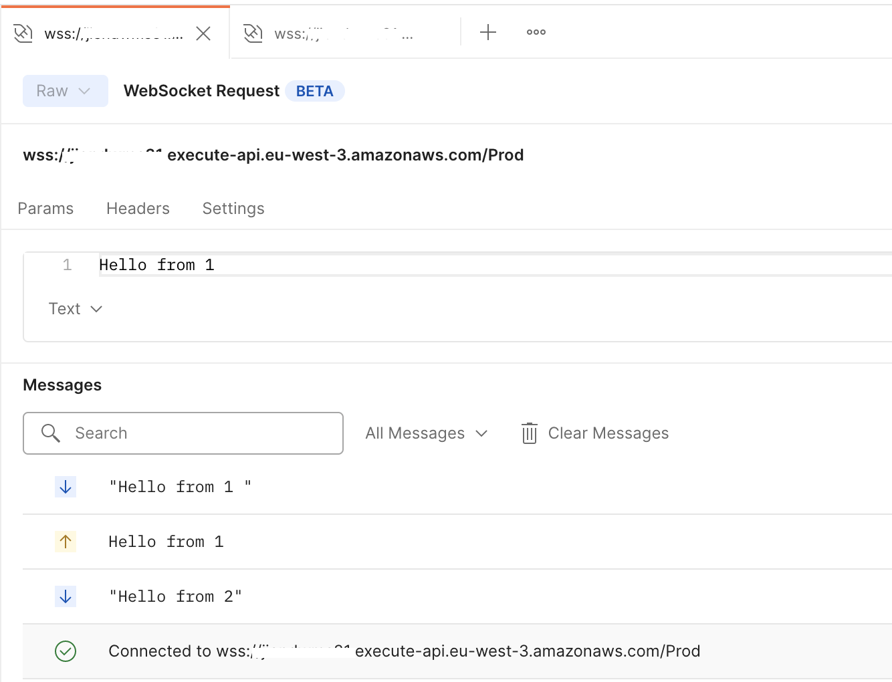

# AWS LAMBDA-websocket-typescript-terraform
A sample project with aws lambda api gateway, websocket ,typescript and terraform

## prerequisite :
- Aws Account
- terraform installed
- postman
## Install & deploy
1. npm run init 
2. npm run build:deploy
## test with postman 
1. get the Url output at the end of deploy task.
- example : wss://jiendwms55.execute-api.eu-west-3.amazonaws.com/Prod
  
2. test via postman
   